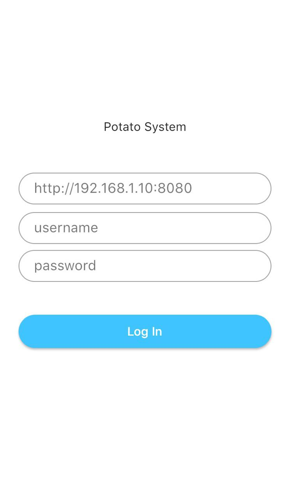

# Effective Potato

Expose a REST API to handle raspberry GPIO pin.

## Getting Started

```
git clone https://github.com/Girbons/effective-potato.git
```

### requirements

- [go](https://golang.org/dl/)
- [flutter](https://flutter.dev/docs/get-started/install)

### Enable Go modules

```
export GO111MODULE=on
```

### Edit the config.yaml

Change the secret in `config.yaml` that is used to generate JWT.

### Run

```
go build -o effective-potato

./effective-potato -create-admin-user

./effective-potato
```

### Install the flutter app

```
cd app/

flutter clean

flutter pub get

flutter build [ios/android]

flutter install
```

<table>
   <tr>
      <td>  </td>
      <td>  </td>
      <td>  </td>
   </tr>
</table>


## Built with

- [go](https://github.com/golang/go)
- [crypto](https://github.com/golang/crypto)
- [gorm](https://github.com/jinzhu/gorm)
- [go-dht](https://github.com/d2r2/go-dht)
- [go-rpio](https://github.com/stianeikeland/go-rpio)
- [go-simplejson](https://github.com/bitly/go-simplejson)
- [logrus](https://github.com/Sirupsen/logrus)
- [mux](https://github.com/gorilla/mux)
- [viper](https://github.com/flutter/flutter)

- [flutter](https://github.com/flutter/flutter)
- [flutter secure storage](https://github.com/mogol/flutter_secure_storage)
